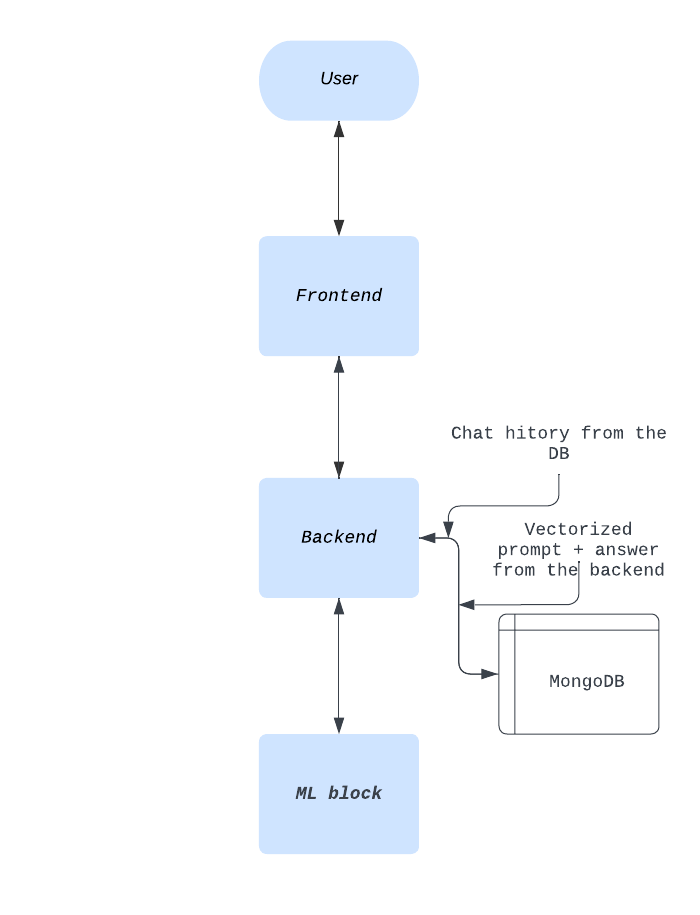

# collabothon_2023_MW, ML
This repo contains the ML part for a psychology Virtual Assistant app. 

# Project description
The challenge was to create a virtual assistant that helps children and their parents to cope with stress, mental hardships. The core of our application is a chatbot, which provides assistance to the user, gives them instructions on how to deal with suicidal thoughts, panic attacks. 

# Tech stack
Both the ML and backend parts were written in Python, using watsonx.ai API, langchain, openai and Django respectively. The frontend part was written in HTML, CSS and JavaScript. MongoDB and PostreSQL were used as our databases.

# ML functionality 
The model used (LLama2, 70B) was provided to us by the IBM WatsonX.ai API. In total, four models were used. For answering prompts: one for translating the input from a user (polish to english), one for generating a response for the translated input (the core model) and one for translating the previously generated response. For detecting the sentiment of prompts only one model was used; ultimately, it determined the behaviour of the core model based on the current message sentiment (the sentiment was detected continuously). Core model states included 'HAPPY', 'SAD', 'ANGRY', 'FRIENDLY' (a regular conversation). 

 # App infrastructure 

The above figure illustrates the pipeline of our project. First, a prompt is received from the user. Then, the frontend sends it to the backend, and the latter sends the vectorized prompt to MongoDB. From the latter, the backend pulls out chat history (also vectorized), and sends it to the model. Then, the model sends its response to the backend that sends the current prompt + answer to the database. The answer goes all the way back to the frontend for the user to see.
